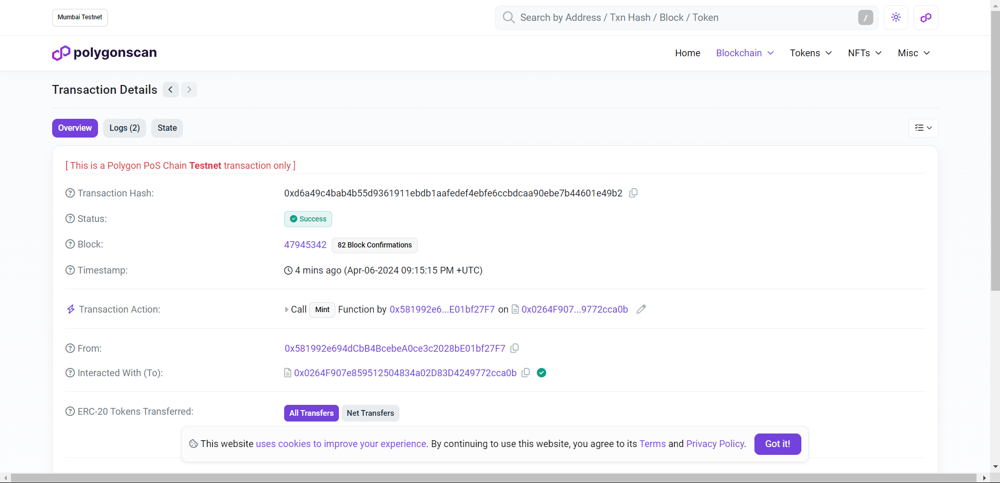
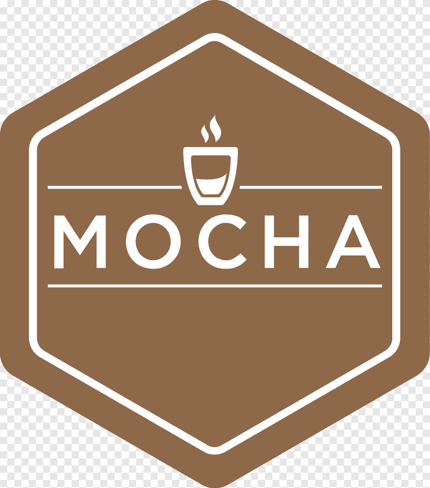

<div align = "center">

<h1 align="center"> <font size="5"> <b> Genz-Dukaan </b></h1>
<!-- PROJECT LOGO -->

<h2><b>🔗 The Next Gen Marketplace</b></h2>

# [DEMO LINK](https://youtu.be/YqVNQXkV5kg)

  </div>
  
---

<div align="center">

  </div>

---

<div align="center" style="display:flex ">

</div>
<table>
  <tr>
    <td></td>
    <td></td>
  </tr>
  <tr>
    <td></td>
    <td></td>
  </tr>
  <tr>
    <td></td>
    <td></td>
  </tr>
  <tr>
    <td></td>
    <td></td>
  </tr>
  <tr>
    <td></td>
    <td></td>
  </tr>
  <tr>
    <td></td>
    <td></td>
  </tr>
</table>

---

## About the Site 🚀

---

A Genz Ecommerce Platform with 3D tryon and Rewards Program

Our project is a pioneering Gen Z marketplace that redefines the online shopping experience through the integration of cutting-edge technology and user-centric design principles. With an array of innovative features tailored to meet the evolving needs of modern consumers, we strive to create a platform that not only facilitates transactions but also fosters engagement and loyalty while upholding principles of digital anonymity.

<br>

● **3D Try-On Feature for T-Shirts**: This groundbreaking feature allows users to transcend the limitations of traditional online shopping by providing them with the ability to visualize how T-shirts will look and fit before making a purchase. Whether through AI prompts that generate virtual T-shirt canvases or by uploading their own designs, users can make informed decisions and confidently select products that align with their preferences.

● **Token Rewards System**: At the heart of our platform lies a robust Token Rewards System designed to incentivize and reward user engagement. By granting tokens based on purchase amount, we seek to nurture customer loyalty and encourage repeat business. These tokens serve as a tangible form of appreciation, empowering users to redeem them for discounts, exclusive offers, and other valuable rewards, thereby creating a mutually beneficial relationship between our platform and its users.

● **Token Transparency**: Transparency is paramount in our ecosystem, and our Token Rewards System is no exception. Through real-time visibility of token status on Etherscan, users can track their earned, available, expired, and redeemed tokens with ease and confidence. Additionally, our dedicated rewards section provides users with a comprehensive overview of their token activity, complete with clear terms and conditions to ensure transparency and accountability.

● **Rewards Section**: Within our platform, users have access to a dedicated rewards section where they can conveniently monitor their token earnings, view expired tokens, and track tokens that have been redeemed. This centralized hub serves as a valuable resource for users to stay informed about their rewards and make informed decisions about how to best utilize them.

● **NFT Marketplace**: In addition to traditional products, our marketplace features a secure platform for NFT exchanges and token sales. Upholding principles of digital anonymity and privacy, users can confidently engage in transactions within this decentralized marketplace, exploring unique digital assets and participating in the growing NFT ecosystem.

● **User Authentication**: To ensure the security and privacy of our users, we employ a secure process for registration and login using JWT (JSON Web Tokens). This authentication mechanism not only safeguards user accounts against unauthorized access but also provides a seamless and personalized shopping experience tailored to each user's preferences and browsing history.

● **Account Dashboard**: Within our user-friendly account dashboard, users can access a wealth of information and functionality designed to enhance their shopping experience. From tracking orders and managing account details to monitoring token activity and earning visibility, our dashboard provides users with comprehensive control and visibility over their interactions with our platform.

● **Safe Payment Handling**: Security is paramount when it comes to online transactions, which is why we've implemented a reliable payment gateway to handle all financial transactions securely and efficiently. By employing industry-leading encryption protocols and security measures, we ensure that users can shop with confidence, knowing that their sensitive information is protected at all times.

● **Tailored Recommendations**: Leveraging the power of data analytics and machine learning, our platform delivers personalized product recommendations to each user based on their purchase history, browsing behavior, and preferences. By presenting users with curated selections that resonate with their individual tastes and interests, we enhance the relevance and value of their shopping experience, driving engagement and satisfaction.

● **Instant Chat Assistance**: For users in need of assistance or guidance, our responsive chatbot is on hand to provide instant support and guidance. Whether answering questions about products, assisting with technical issues, or facilitating transactions, our chatbot enhances the overall shopping experience by providing prompt and personalized assistance whenever and wherever it's needed.

<!-- ● **Deployment**: Used the Polygon blockchain to deploy our solution and demonstrate the final product. -->

## <!-- ●   WE used the Polygon blockchain to deploy our solution and demo the final product as a web prototype🔗<br> -->

## How to Run Client Side of the Website⚡

---

```
1. git clone https://github.com/shokushwaha/genz-dukan

2. cd client

3. npm install

4. Create a .env file and add the following environment variables:

MONGODB_URI=""
STRIPE_PK=""
STRIPE_SK=""
PUBLIC_URL=""
NODE_ENV=''
GOLD_URL=""
PREMIUM_URL=""
SILVER_URL=""
BRONZE_URL=""
OPENAI_API=""

5. npm run dev
```

## How to Run Admin Side of the Website⚡

---

```
1. git clone https://github.com/shokushwaha/genz-dukan

2. cd admin

3. npm install

4. Create a .env file and add the following environment variables:

GOOGLE_CLIENT_ID=""
GOOGLE_CLIENT_SECRET=""
NEXT_AUTH_SECRET=""
MONGODB_URI=""
NODE_ENV=""

5. npm run dev
```

## Tech Stack 💻

---

### WEB 3.0 :

- Hardhat 
  </div>
- Mocha 
  </div>
- Solidity 
  </div>
- Polygon 
  </div>

### Frontend :

  

### Backend :

 

## Contributors ✨

Thanks goes to these wonderful people ❤️

<!-- ALL-CONTRIBUTORS-LIST:START - Do not remove or modify this section -->
<!-- prettier-ignore-start -->
<!-- markdownlint-disable -->
<table>
  <tr>
    <td align="center"><a href="https://github.com/shokushwaha"><br /><sub><b>Shobhit Kushwaha</b></sub></a><br /></td>
    <td align="center"><a href="https://github.com/RishabhSharma96"><br /><sub><b>Rishabh Sharma</b></sub></td>
    <td align="center"><a href="https://github.com/rohitsinghh01"><br /><sub><b>Rohit Raj</b></sub></td>
      <td align="center"><a href="https://github.com/maheshpulivarthi18"><br /><sub><b>Pulivarthi Mahesh</b></sub></td>
  </tr>
</table>

<!-- markdownlint-restore -->
<!-- prettier-ignore-end -->

<!-- ALL-CONTRIBUTORS-LIST:END -->
